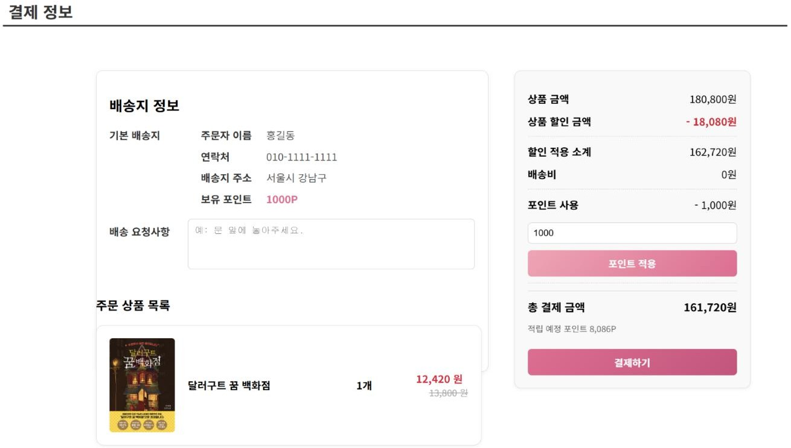
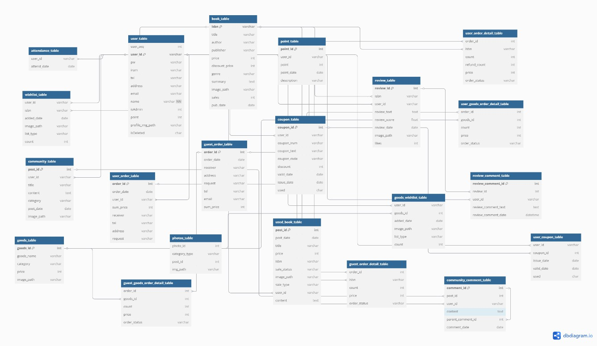
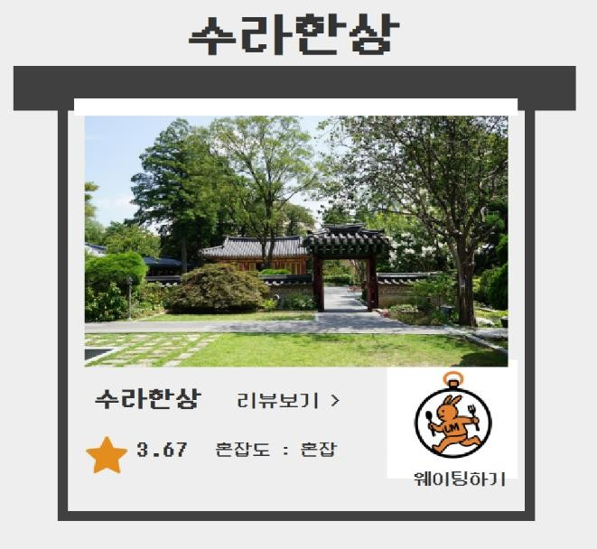
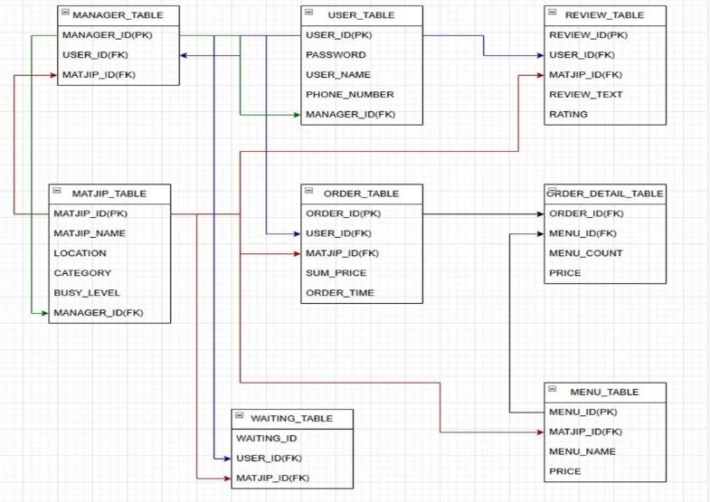

# Portfolio

## 김서연 | Kim Seoyeon

**시행착오를 줄이기 위해 더 많이 도전하는 백엔드 개발자입니다.**
주문, 결제 로직과 Oracle DB 설계를 맡았고, 오류가 나면 처리 단계를 순서대로 점검해 원인을 찾습니다.

- Email: kimseoyeon33@gmail.com
- GitHub: https://github.com/kimseoyeon6465
- 프로젝트 기술서: [docs/project-description.pdf](docs/project-description.pdf)
- 포트폴리오 PPT: [docs/portfolio.pdf](docs/portfolio.pdf)

---

## 목차
- [대표 프로젝트](#대표-프로젝트)
- [DasiBom](#dasibom---온라인-도서-커머스-웹-사이트)
- [MatjipON](#matjipon---식당-웨이팅예약-관리-프로그램)
- [게임 프로젝트](#게임-프로젝트)
- [보유 기술](#보유-기술)
- [학력, 교육, 자격, 경력](#학력-교육-자격-경력)
- [입사 후 포부](#입사-후-포부)

---

## 대표 프로젝트

| 프로젝트 | 기간 / 인원 | 담당 | 기술 | 링크 |
|---|---|---|---|---|
| DasiBom | 2025.06.10 ~ 06.30 / 5명 | 장바구니, 주문, 결제 서비스 / 전체 DB 설계 | Java, Spring MVC, MyBatis, Oracle, JSP | [GitHub](https://github.com/kimseoyeon6465/Dasibom) / [YouTube](https://youtu.be/BgfCU3VaJDs) |
| MatjipON | 2025.04.15 ~ 04.28 / 4명 | 대기 순번, 키오스크 주문 저장, 리뷰 별점 조회 | Java, Java Swing, JDBC, Oracle | [GitHub](https://github.com/kimseoyeon6465/MatjipON) / [YouTube](https://www.youtube.com/watch?v=3oiHsrP-0ZQ) |

---

## DasiBom - 온라인 도서 커머스 웹 사이트

| 항목 | 내용 |
|---|---|
| 기간 | 2025.06.10 ~ 2025.06.30 (약 3주) |
| 인원 | 5명 (팀 프로젝트) |
| 담당 | 회원/비회원 장바구니, 주문, 결제 서비스 / 전체 DB 설계 (DB 담당) |
| 기술 | Java, Spring MVC, MyBatis, Oracle, JSP, JavaScript, jQuery, 포트원(구 아임포트) SDK 카카오페이 테스트 결제, Tomcat 8.5 |
| GitHub | https://github.com/kimseoyeon6465/Dasibom |
| YouTube | https://youtu.be/BgfCU3VaJDs |

도서 검색, 리뷰, 장바구니, 중고 거래, 채팅 기능을 포함한 온라인 서점 웹 사이트입니다. 도서 탐색부터 구매까지를 하나의 사이트에서 처리하고, 전자상거래의 주문과 결제 구조를 직접 구현해 보기 위해 기획했습니다.

### 담당 업무
- 회원/비회원 장바구니, 주문, 결제 전 과정 설계 및 구현
- 도서 10% 할인가, 배송비(5만원 미만 3,000원), 포인트 사용과 5% 적립을 반영한 결제 금액 계산
- 포트원 SDK를 이용한 카카오페이 결제창 호출, 결제 성공 콜백 처리 후 주문 저장
- 회원 주문 테이블 3개와 비회원 주문 테이블 3개를 분리하는 DB 설계
- DB 담당: 전체 테이블 설계, 참조 방식과 변수명 기준 정리

### 핵심 구현
- **결제 금액 계산과 결제 요청:** 결제하기를 누르면 포인트 적용 계산을 먼저 실행하고, 확정된 최종 금액으로 카카오페이 결제창을 호출합니다.
- **결제 성공 후 주문 저장:** 결제 성공 응답을 받은 뒤에만 주문, 주문 상세, 포인트 차감과 적립, 장바구니 비우기를 처리합니다. 주문은 '결제완료' 상태로 저장됩니다.
- **회원/비회원 주문 처리:** 비회원 주문번호는 시퀀스로 발급하고, 결제 후 이메일로 주문 내역을 조회합니다.
- **주문 테이블 구조:** 주문, 주문 상세(도서), 주문 상세(굿즈) 3단으로 나누어 한 주문에 도서와 굿즈를 함께 담습니다.

### 트러블슈팅
| 문제 상황 | 원인 분석과 시도 | 해결 결과 |
|---|---|---|
| 카카오페이 테스트 결제 중, 화면에는 10% 할인가가 표시되는데 결제창에는 정가 합계가 요청됨 | 결제 요청, 금액 계산, DB 저장 순서로 점검. 최종 금액이 확정되기 전에 결제 요청이 나가던 시점 문제 | 포인트 계산을 먼저 실행하고 확정된 금액으로만 결제 요청. 카카오페이 결제 금액과 DB 저장 금액 모두 할인가 합계로 일치 |

### 화면과 DB 설계

### 성과 및 아쉬운 점
- 회원/비회원 주문, 결제, 주문 조회를 구현했고 테이블은 회원용 3개, 비회원용 3개로 분리했습니다.
- 5명이 만든 기능을 병합 오류 없이 합쳐 완성했습니다. DB 담당으로 테이블 구조와 변수명 기준을 정리해 팀에 공유했습니다.
- 서버에서 결제 금액을 다시 검증하는 로직과, 결제는 성공했지만 주문 저장이 실패한 경우의 처리는 구현하지 못했습니다.
- 보완 계획: Naver Pay, Toss Pay 추가 / 취소, 환불까지 포함한 주문 상태 정의 / 비회원 본인 확인 강화

---

## MatjipON - 식당 웨이팅/예약 관리 프로그램

| 항목 | 내용 |
|---|---|
| 기간 | 2025.04.15 ~ 2025.04.28 (약 2주) |
| 인원 | 4명 (팀 프로젝트) |
| 담당 | 대기 순번 관리 / 키오스크 주문 저장 / 리뷰와 별점 조회 / DB 모델링 |
| 기술 | Java, Java Swing, JDBC, Oracle, SQL |
| GitHub | https://github.com/kimseoyeon6465/MatjipON |
| YouTube | https://www.youtube.com/watch?v=3oiHsrP-0ZQ |

식당의 웨이팅, 예약, 주문, 결제 정보를 통합 관리하는 Java Swing 기반 프로그램입니다. 맛집 탐색, 대기, 예약, 결제를 각각 다른 앱으로 처리해야 하는 불편을 줄이기 위해 기획했습니다.

### 담당 업무
- 대기 등록 및 순번 관리: 취소, 삭제 시 ROW_NUMBER()로 대기 순번(waiting_id) 재정렬
- 키오스크 주문 저장: 주문을 ORDER_TABLE과 ORDER_DETAIL_TABLE에 저장하고 주문번호 기준으로 영수증 형태 조회
- 리뷰 등록, 조회, 삭제와 매장별 평균 별점 조회, 관리자 리뷰 관리와 혼잡도 반영
- Oracle DB 모델링, JDBC 연동, 예외 처리

### 핵심 구현
- **웨이팅 순번 관리:** 등록 시각(INSERT_TIME) 기준으로 ROW_NUMBER()를 적용해 순번을 다시 매깁니다. 삭제 후에는 DB를 다시 조회해 화면과 DB 상태를 맞춥니다.
- **키오스크 주문 저장:** 주문 단위와 메뉴 단위로 나누어 두 테이블에 저장하고, 주문번호로 조회해 JTable로 영수증 형태로 출력합니다.
- **평균 별점 조회:** 별점 평균을 저장하지 않고, 조회할 때 `AVG(RATING)`으로 계산해 표시합니다.

### 트러블슈팅
| 문제 상황 | 원인 분석과 시도 | 해결 결과 |
|---|---|---|
| 마감 직전, 키오스크 화면(메뉴 버튼 8개)만 있고 DB 연결이 없던 기능을 인수 | 설명 없이 넘겨받은 코드를 직접 읽어 구조 파악. 메뉴 번호 1~8 하드코딩, 매장 5곳으로 관리할 변수가 40개 | 변수를 배열로 정리하고 DB 연동과 주문 저장까지 연결. 마감 기한 안에 완성 |

### 화면과 DB 설계

### 성과 및 아쉬운 점
- 대기 순번 재정렬, 키오스크 주문 저장과 영수증 조회, 평균 별점 조회를 구현했습니다.
- 마감 직전에 인수한 키오스크 기능을 DB 저장까지 연결해 마감 안에 완성했습니다.
- 키오스크 주문은 메뉴와 금액을 DB에 저장하는 데까지 구현했고, 결제 모듈 연동과 입장 알림은 구현하지 못했습니다.

---

## 게임 프로젝트

게임 소프트웨어 전공과 이후 개인 학습에서 진행한 프로젝트입니다.

<b>JUST ONE BOSS</b> - 회피형 아케이드 게임 (2025.10 ~ 2026.01, 개인, Unity, C#)

- 보스의 공격 패턴을 피하며 생존하는 게임입니다. 원작 구조를 분석해 공격 패턴과 난이도 구성을 재구성한 변형 구현입니다.
- 보드, 타일, 패턴, 경고 시스템을 역할 단위로 분리하고 `BoardManager` 중심으로 실행 순서 통합
- 보스 공격 패턴을 JSON 데이터로 정의하고 `PhaseController`에서 페이즈 전환과 실행 담당
- 입력 해석과 이동, 애니메이션 로직 분리
- `GameInitializer`로 Awake/Start 실행 순서에 의존하지 않고 초기화 순서를 명시적으로 관리
- GitHub: https://github.com/kimseoyeon6465/UnityGameLab/tree/JustOneBoss

<b>Escape Tower</b> - 3D 방탈출 게임 (2022.09 ~ 2023.05, 개인, Unity, C#)

- 퍼즐 진행, 아이템 획득, 상호작용 결과를 `GameController` 중심으로 관리하고 퍼즐 오브젝트는 트리거 역할만 수행
- 드래그, 충돌, 회전 기반 상호작용을 오브젝트 단위로 분리
- 아이템 획득과 사용을 분리해 획득 여부만 상태로 저장
- 플레이어 이동과 카메라 제어를 분리하고, 시간 제한과 환경 요소를 결합한 퍼즐 구성
- GitHub: https://github.com/kimseoyeon6465/Escape-Tower
- YouTube: https://www.youtube.com/watch?v=HS-QF0Z39VY

<b>King Wizard</b> - 3D 러닝 액션 게임 (2022.03 ~ 2022.06, 3인, Unity, C#)

- 이동 동선과 점프 리듬 기준 맵 구성
- 플레이 불가능한 경로가 생성되지 않도록 생성 범위를 제한한 플랫폼 랜덤 생성
- SceneManager 기반 Scene 전환, UI는 입력 트리거 역할로 제한
- GitHub 브랜치 전략 기반 병렬 개발, Scene, 맵, UI 역할 분리로 충돌 최소화
- GitHub: https://github.com/kimseoyeon6465/2022_Teamproject
- YouTube: https://www.youtube.com/watch?v=WqBF9F-ON3A

<b>Minesweeper</b> - C++ 콘솔 지뢰찾기 (2022.10, 개인, C++, WinAPI)

- 1차원 배열로 2차원 보드를 처리하고, DFS 재귀 탐색으로 인접한 빈 영역 자동 오픈
- 방문 여부와 처리 상태를 배열로 분리 관리해 중복 처리 방지
- 트러블슈팅: 무한 재귀로 프로그램이 멈추는 오류를 호출마다 상태와 좌표를 추적해 해결. 종료 조건을 분리하고 배열 2개로 상태를 나누어 관리
- GitHub: https://github.com/kimseoyeon6465/Minesweeper
- YouTube: https://www.youtube.com/watch?v=CK9b8Uc0fAY

---

## 보유 기술

| 구분 | 내용 |
|---|---|
| 웹 개발 | Spring MVC 기반 웹 애플리케이션 개발 (Controller, Service, DAO 계층 분리) MyBatis 기반 Oracle 연동 CRUD JSP, EL, JSTL 기반 화면 처리 JavaScript, jQuery (장바구니 금액 재계산, 선택 상품만 결제 대상으로 전달) 포트원 SDK 카카오페이 테스트 결제 연동 |
| 데이터베이스 | Oracle 기반 주문, 결제 DB 설계 (회원/비회원 주문, 포인트, 리뷰 등 다중 테이블 관계 설계) 시퀀스 기반 PK 생성, JOIN 활용 조회 ROW_NUMBER() 기반 순번 재정렬 주문번호 기준 다중 테이블 조회 SQL |
| 언어 | Java (객체지향 서버 로직, 컬렉션 기반 처리) Python (DFS, BFS, 정렬, 탐색 알고리즘 학습) C++, C# |
| 사용 경험 | Spring Boot, REST API (교육과정 실습) JDBC (MatjipON) MySQL (학부 DB 수업), Linux (교육과정) |
| 게임 개발 | Unity 기반 2D, 3D 게임 개발 (NavMesh 적 추적, Coroutine 상태 관리, RenderTexture 미니맵) DirectX 자유시점 카메라, 행렬 변환 |
| 협업 | GitHub 형상관리, 브랜치 전략 팀 프로젝트 DB 담당 |

---

## 학력, 교육, 자격, 경력

**학력**
- 홍익대학교 세종캠퍼스 게임소프트웨어전공 졸업 (2019.03 ~ 2024.02, 3.43/4.5)

**교육**
- KG에듀원 아이티뱅크 - 핀테크 서비스를 위한 풀스택 개발자 양성과정 (2025.03 ~ 2025.09, 968H)
  - Java, Spring Framework 기반 웹 서버 구축과 Oracle DB 연동
  - 프론트엔드 및 API 활용을 포함한 웹 서비스 개발 과정을 팀 프로젝트로 수행

**자격, 수상**
- 정보처리기사 (필기 합격), 한국산업인력공단 (2025.05)
- 홍익대학교 게임 공모전 우수상 - 노아조 'INSOMNIA' (2022.03)

**경력**
- 씨제이올리브영 메이트 (2023.07 ~ 2023.12): 고객 응대 및 상품 관리
- 터닝포인트짐 위례광장점 인포데스크 (2021.01 ~ 2021.12): 회원 응대 및 상담
- 스타벅스코리아 바리스타 (2020.08 ~ 2020.12): 음료 제조 및 고객 응대
- 강남SK학원 학습조교 (2019.08 ~ 2020.02): 질의 응답 및 학습 멘토

**동아리**
- 홍익대학교 게임 개발 동아리 I2P X O2CUBE: 노아조 팀 팀장으로 2D 게임 INSOMNIA 기획 및 개발, 이후 부회장으로 운영 및 멘토링 담당, C++ 학술회와 코딩테스트 학술회 참여

---

## 입사 후 포부

**실패의 원인을 빠르게 정리해 더 나은 선택으로 이어가는 개발자가 되겠습니다.**
